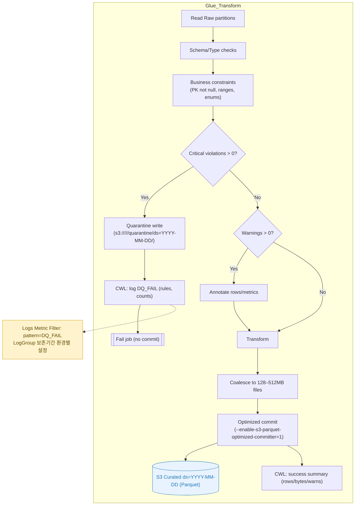

```mermaid
flowchart TD
  subgraph Glue_Transform
    R["Read Raw partitions"] --> S["Schema/Type checks"]
    S --> C["Business constraints<br/>(PK not null, ranges, enums)"]
    C --> D{Critical violations > 0?}
    D -->|Yes| Q["Quarantine write<br/>(s3://<curated-bucket>/<domain>/<table>/quarantine/ds=YYYY-MM-DD/)"]
    Q --> L1["CWL: log DQ_FAIL (rules, counts)"]
    L1 --> F[["Fail job (no commit)"]]
    D -->|No| W{Warnings > 0?}
    W -->|Yes| AN["Annotate rows/metrics"]
    W -->|No| T["Transform"]
    AN --> T
    T --> CO["Coalesce to 128–512MB files"]
    CO --> K["Optimized commit<br/>(--enable-s3-parquet-optimized-committer=1)"]
    K --> CUR[("S3 Curated ds=YYYY-MM-DD (Parquet)")]
    K --> L2["CWL: success summary (rows/bytes/warns)"]
  end

  %% Observability note
  Nobs["Logs Metric Filter: pattern=DQ_FAIL<br/>LogGroup 보존기간 환경별 설정"]:::note
  L1 -.-> Nobs

  classDef store fill:#e8f3ff,stroke:#1f77b4,color:#1f77b4;
  classDef note fill:#fff3cd,stroke:#d39e00,color:#5c4800;
  class CUR store;
```
