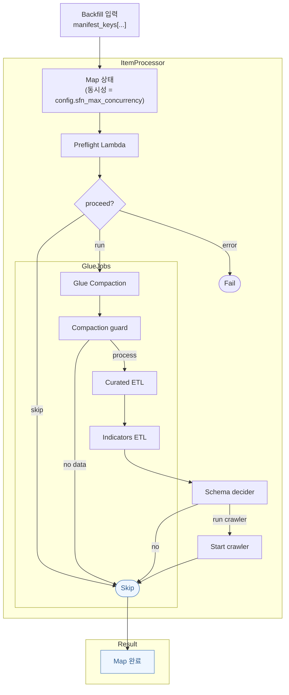

```mermaid
flowchart TD
  A["Backfill 입력<br/>manifest_keys[...]"] --> M["Map 상태<br/>(동시성 = config.sfn_max_concurrency)"]

  subgraph ItemProcessor
    M --> P["Preflight Lambda"]
    P --> D{proceed?}
    D -->|skip| SKIP(["Skip"])
    D -->|error| FAIL(["Fail"])
    D -->|run| COMP["Glue Compaction"]
    subgraph GlueJobs
      COMP --> GUARD["Compaction guard"]
      GUARD -->|no data| SKIP
      GUARD -->|process| ETL["Curated ETL"]
      ETL --> IND["Indicators ETL"]
    end
    IND --> DECIDE["Schema decider"]
    DECIDE -->|run crawler| CRAWLER["Start crawler"]
    DECIDE -->|no| SKIP
    CRAWLER --> SKIP
  end

  subgraph Result
    SKIP --> Z["Map 완료"]
  end

  classDef skip fill:#eef6ff,stroke:#5080c1,color:#2d5a8d;
  class SKIP,Z skip;
```
