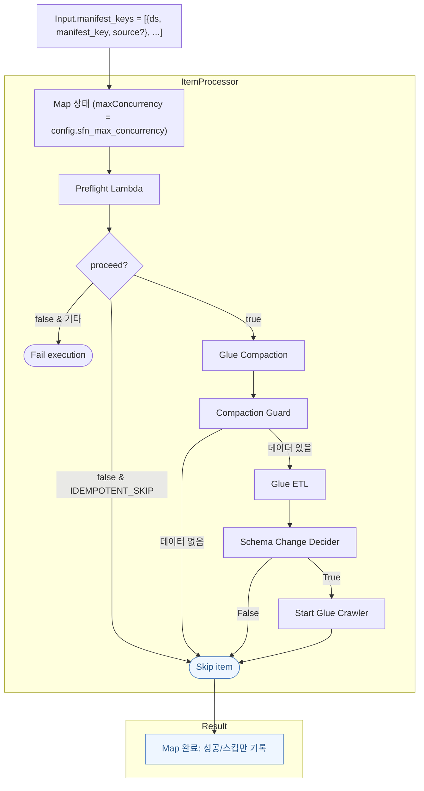

```mermaid
flowchart TD
  A["Input.manifest_keys = [{ds, manifest_key, source?}, ...]"] --> M["Map 상태 (maxConcurrency = config.sfn_max_concurrency)"]

  subgraph ItemProcessor
    M --> P["Preflight Lambda"]
    P --> D{proceed?}
    D -->|false & IDEMPOTENT_SKIP| SKIP(["Skip item"])
    D -->|false & 기타| FAIL(["Fail execution"])
    D -->|true| COMP["Glue Compaction"]
    COMP --> GUARD["Compaction Guard"]
    GUARD -->|데이터 없음| SKIP
    GUARD -->|데이터 있음| ETL["Glue ETL"]
    ETL --> DECIDE["Schema Change Decider"]
    DECIDE -->|True| CRAWLER["Start Glue Crawler"]
    DECIDE -->|False| SKIP
    CRAWLER --> SKIP
  end

  subgraph Result
    SKIP --> Z["Map 완료: 성공/스킵만 기록"]
  end

  classDef skip fill:#eef6ff,stroke:#5080c1,color:#2d5a8d;
  class SKIP,Z skip;
```
