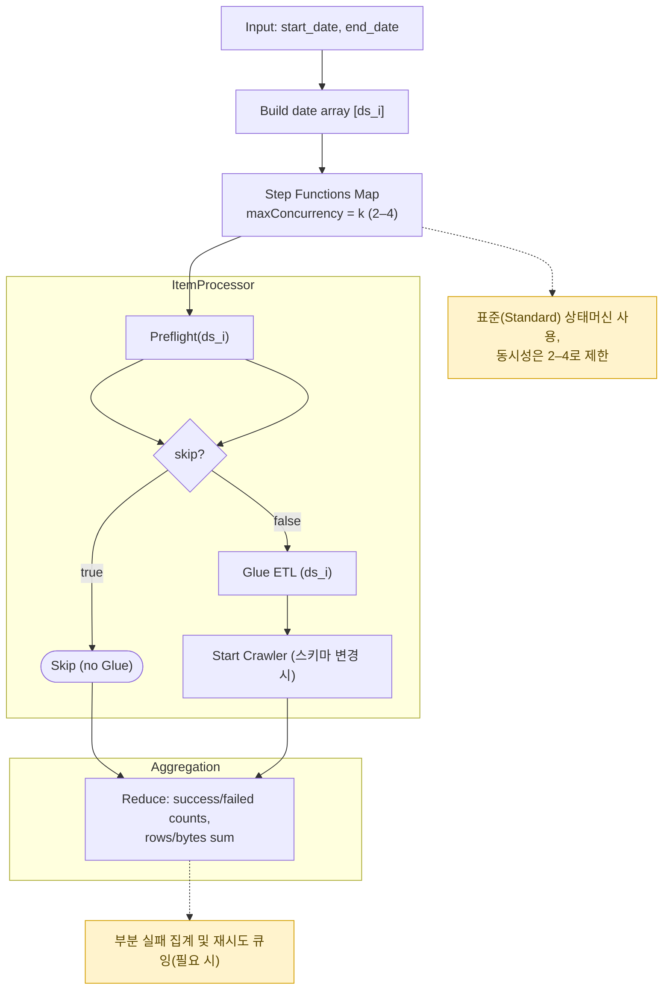

```mermaid
flowchart TD
  A["Input: start_date, end_date"] --> B["Build date array [ds_i]"]
  B --> M["Step Functions Map<br/>maxConcurrency = k (2–4)"]

  subgraph ItemProcessor
    I1["Preflight(ds_i)"] --> J{skip?}
    J -->|true| SKIP(["Skip (no Glue)"])
    J -->|false| G["Glue ETL (ds_i)"]
    G --> CR["Start Crawler (스키마 변경 시)"]
    
  end

  M --> I1
  I1 --> J
  SKIP --> Z
  CR --> Z
  subgraph Aggregation
    Z["Reduce: success/failed counts,<br/>rows/bytes sum"]
  end

  %% Notes
  N1["표준(Standard) 상태머신 사용,<br/>동시성은 2–4로 제한"]:::note
  N2["부분 실패 집계 및 재시도 큐잉(필요 시)"]:::note
  M -.-> N1
  Z -.-> N2

  classDef note fill:#fff3cd,stroke:#d39e00,color:#5c4800;
```
