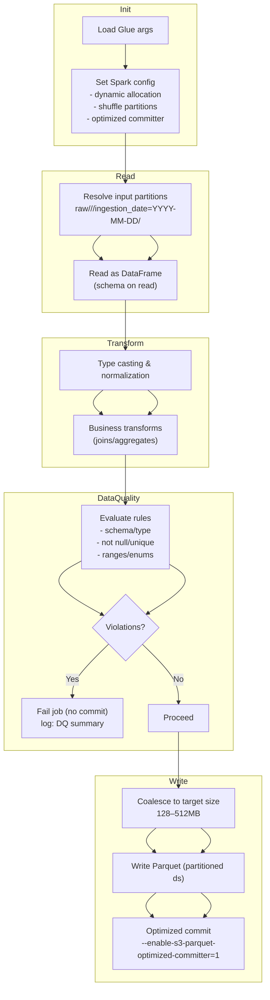

# Glue Job Internals (Mermaid)

비고

- Spark 설정: Glue 4/5, 오토스케일 on, 셔플 파티션 수는 데이터량에 맞춰 조정.
- 데이터 품질: 치명 규칙 위반 시 커밋 차단(부분 결과 노출 방지). 경고 규칙은 통과 후 로그/메트릭 집계 가능.
- 쓰기: 임시 경로 → 최종 경로 원자적 커밋. Parquet+ZSTD, 파일 크기 타깃 128–512MB.
- 증분: Job Bookmark + 파티션 프루닝으로 스캔 최소화.

권장 Spark 튜닝(DPU=2 고정 가정)

- `spark.sql.shuffle.partitions`: 데이터량에 따라 64–128 범위로 시작
- `spark.default.parallelism`: `spark.sql.shuffle.partitions`와 동일값 권장
- 작은 룩업 조인: 브로드캐스트 조인 사용, 불필요한 `repartition` 지양
- 파일 병합: `coalesce(n)` 또는 `maxRecordsPerFile`로 평균 256MB 근접
