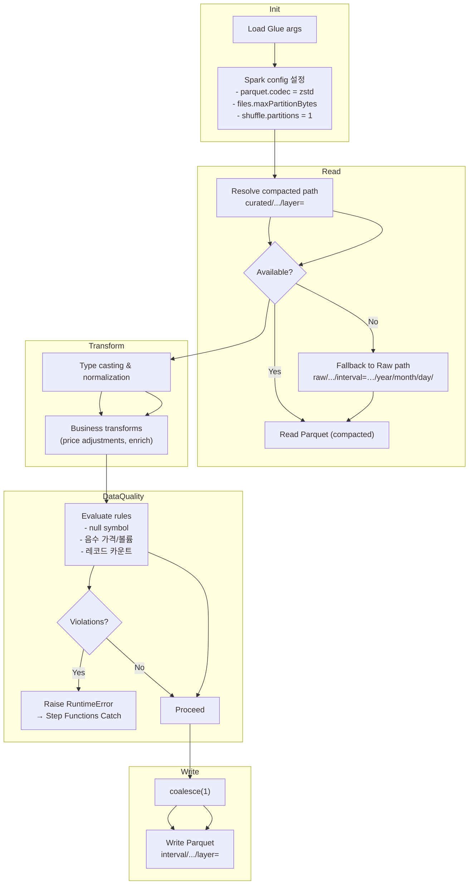

# Glue Job Internals (Mermaid)



비고

- 컴팩션 잡과 변환 잡 모두 Glue 5.0 환경을 사용하며, Spark 설정은 코드(`raw_to_parquet_compaction.py`, `daily_prices_data_etl.py`)에서 직접 제어합니다.
- 데이터 품질 실패 시 `RuntimeError("DQ_FAILED: …")`를 발생시켜 Step Functions Catch 체인으로 전파합니다.
- 출력 파티션: `interval`, `data_source`, `year`, `month`, `day`, `layer`. 데이터 내부에는 `ds` 컬럼이 함께 저장됩니다.
- Schema fingerprint는 변환 잡 종료 시 아티팩트 버킷에 `latest.json`/`previous.json` 형태로 기록되어 Crawler 실행 여부 판단에 활용됩니다.
```
