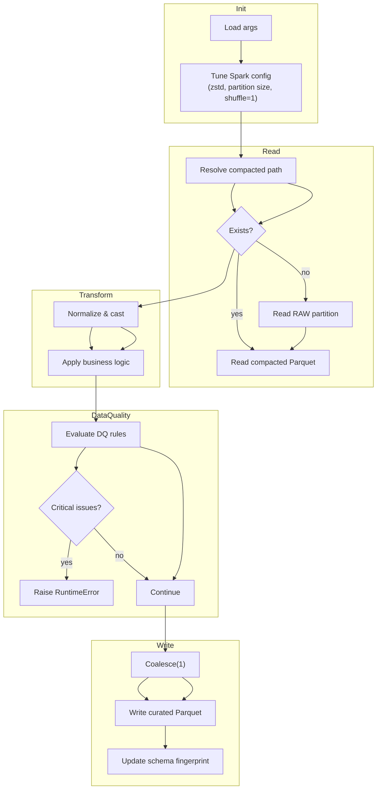

# Glue Job Internals (Mermaid)



비고

- Glue 5.0 환경에서 실행되며 Spark 설정은 잡 코드에서 직접 제어합니다.
- DQ 위반 시 `RuntimeError`를 던져 Step Functions에서 캐치합니다.
- 출력 파티션 키: `interval`, `data_source`, `year`, `month`, `day`, `layer` (`ds` 컬럼 포함).
- 스키마 지문은 아티팩트 버킷에 `latest.json`/`previous.json`으로 유지됩니다.
```
