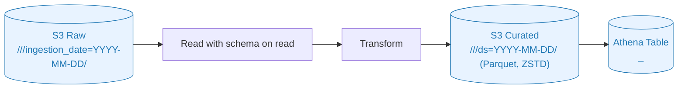
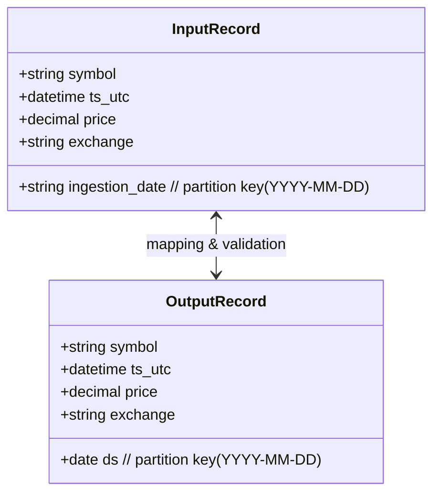

# IO & Schema (Mermaid)

비고

- 입력 파티션 키: `ingestion_date=YYYY-MM-DD` (UTC)
- 출력 파티션 키: `ds=YYYY-MM-DD` (UTC)
- 파일 포맷: Parquet + ZSTD
- 테이블 노출: Glue Catalog/Athena 테이블 `<domain>_<table>`
- 카탈로그 갱신: 스키마 변경 감지 시에만 크롤러 실행(기본은 스킵)
