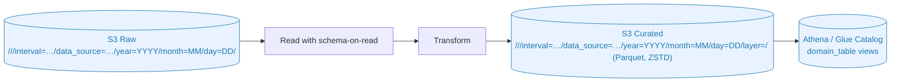
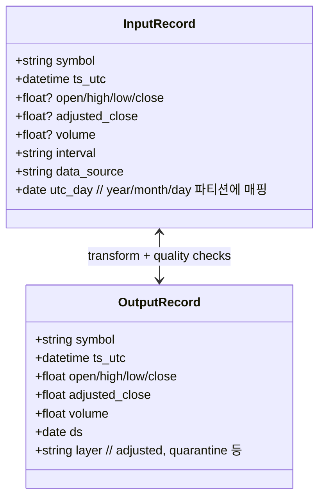

# IO & Schema (Mermaid)





비고

- RAW 파티션 키: `interval`, `data_source`, `year`, `month`, `day`.
- Curated 파티션 키: `year`, `month`, `day`, `layer` (`adjusted`, `compacted`, `quarantine` 등). 데이터에는 `ds` 컬럼이 포함됩니다.
- 파일 포맷: Parquet + ZSTD, Spark `coalesce(1)`로 일일당 1개 파일 기본.
- 스키마 지문은 `s3://<artifacts>/<domain>/<table>/_schema/latest.json`에 기록되며 Preflight/Schema Decider에서 활용합니다.
- Athena/Glue 노출은 IaC 또는 crawler 정책(스키마 변경 시)에 따라 관리합니다.
```
