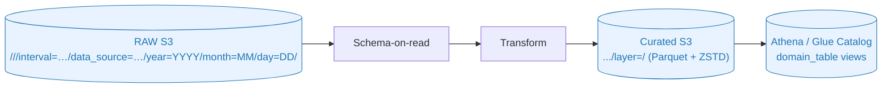
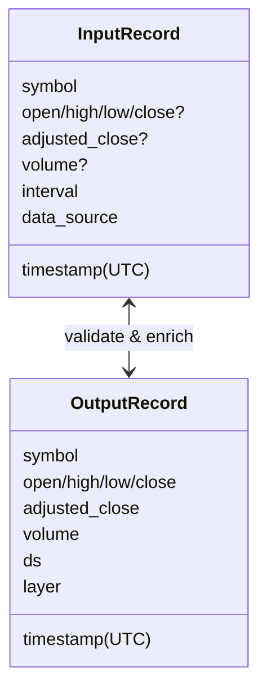

# IO & Schema (Mermaid)





비고

- RAW 파티션 키: `interval`, `data_source`, `year`, `month`, `day`.
- Curated 파티션 키: `year`, `month`, `day`, `layer` (`ds` 컬럼 포함).
- 스키마 지문은 `s3://<artifacts>/<domain>/<table>/_schema/latest.json`에 기록되어 Preflight/Schema Decider에서 활용됩니다.
```
