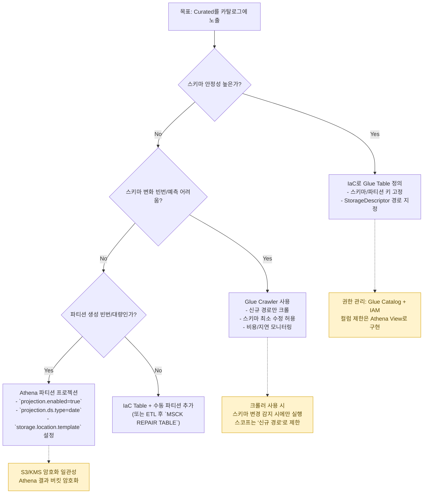

# Catalog Strategy Decision Tree (Mermaid)

비고

- IaC 테이블 정의: 스키마가 안정적일 때 최선. 파티션 키(`ds`)와 S3 경로를 코드로 고정하여 예측 가능한 쿼리/권한 모델을 유지합니다.
- 파티션 프로젝션: 파티션 생성이 잦거나 대량일 때 비용/지연을 크게 줄입니다. 날짜 범위 쿼리에 특히 유리합니다.
- 크롤러: 스키마 변화가 잦을 때만 제한적으로 사용하고, 상태 머신에서 스키마 지문 비교로 변경을 감지한 경우에만 실행합니다. 대상은 신규 경로로 제한하여 비용/지연을 통제합니다. 구현 시 `RecrawlPolicy=CRAWL_NEW_FOLDERS_ONLY` 설정을 권장합니다.
