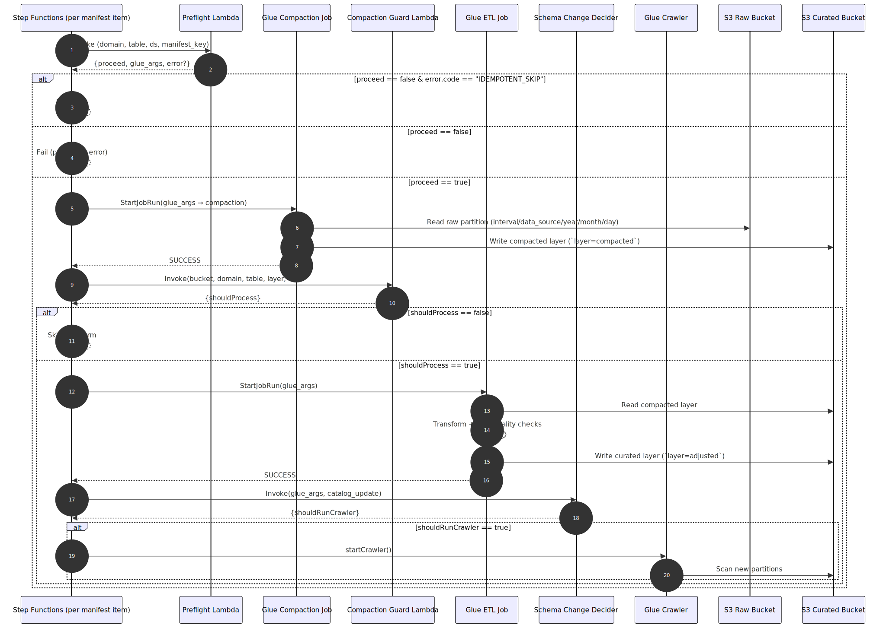

# Transform Diagrams Overview

#### [Components]

- 리소스 및 구성요소
 

#### [Flow]

- 맵 상태를 통한 Preflight → Glue → Crawler 흐름
 

#### [Sequence]

- 단일 manifest 항목 처리 시퀀스
 

#### [Data Quality Gate]

- Glue ETL 내 품질 검사/격리 경로
 

#### [Backfill Map]

- manifest 기반 Map 상태 구조
 

#### [Glue Internals]

- Glue Job 단계별 작업 요약
 

#### [IO &amp; Schema (Curated)]

- RAW → Curated 경로와 파티션 구조
<b/r>

#### [IO &amp; Schema (Class)]

- 입력/출력 레코드 필드 매핑
 