# Transform Diagrams Overview

| Diagram | 미리보기 | 설명 |
|---------|-----------|------|
| Components |  | 상태 머신과 관련 리소스 구성요소 |
| Flow |  | 맵 상태를 통한 Preflight→Glue→Crawler 흐름 |
| Sequence |  | 단일 manifest 항목 처리 시퀀스 |
| Data Quality Gate |  | Glue ETL 내 품질 검사/격리 경로 |
| Backfill Map |  | manifest 기반 Map 상태 구조 |
| Glue Internals |  | Glue Job 단계별 작업 요약 |
| IO & Schema (Curated) |  | RAW→Curated 경로와 파티션 구조 |
| IO & Schema (Class) |  | 입력/출력 레코드 필드 매핑 |
| Catalog Strategy |  | 크롤러/테이블 전략 결정 트리 |

