# Transform Diagrams Overview

<table style="width:100%; table-layout:fixed;">
  <thead>
    <tr>
      <th style="width:12%;">Diagram</th>
      <th style="width:68%;">미리보기</th>
      <th style="width:20%;">설명</th>
    </tr>
  </thead>
  <tbody>
    <tr>
      <td>Components</td>
      <td></td>
      <td>상태 머신과 관련 리소스 구성요소</td>
    </tr>
    <tr>
      <td>Flow</td>
      <td></td>
      <td>맵 상태를 통한 Preflight→Glue→Crawler 흐름</td>
    </tr>
    <tr>
      <td>Sequence</td>
      <td></td>
      <td>단일 manifest 항목 처리 시퀀스</td>
    </tr>
    <tr>
      <td>Data Quality Gate</td>
      <td></td>
      <td>Glue ETL 내 품질 검사/격리 경로</td>
    </tr>
    <tr>
      <td>Backfill Map</td>
      <td></td>
      <td>manifest 기반 Map 상태 구조</td>
    </tr>
    <tr>
      <td>Glue Internals</td>
      <td></td>
      <td>Glue Job 단계별 작업 요약</td>
    </tr>
    <tr>
      <td>IO &amp; Schema (Curated)</td>
      <td></td>
      <td>RAW→Curated 경로와 파티션 구조</td>
    </tr>
    <tr>
      <td>IO &amp; Schema (Class)</td>
      <td></td>
      <td>입력/출력 레코드 필드 매핑</td>
    </tr>
    <tr>
      <td>Catalog Strategy</td>
      <td></td>
      <td>크롤러/테이블 전략 결정 트리</td>
    </tr>
  </tbody>
</table>
