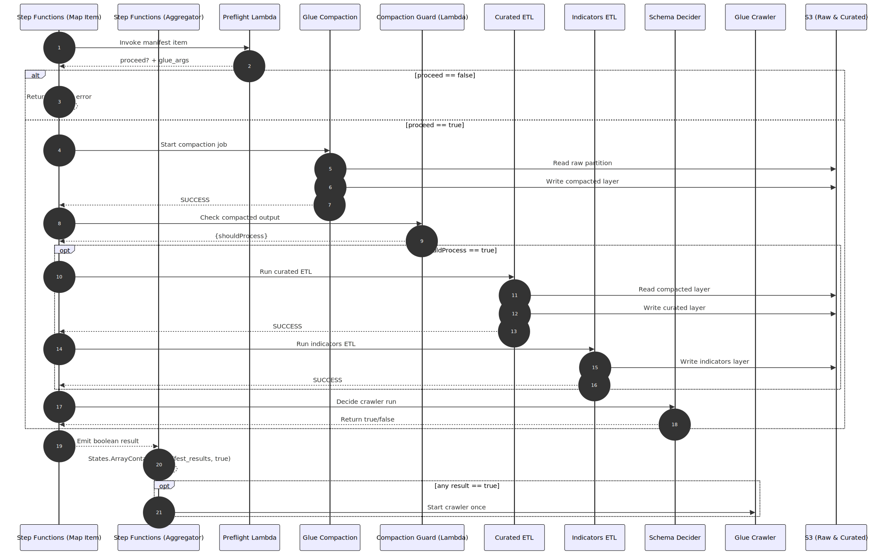

# Transform Diagrams Overview

\[이미지 클릭\] → \[오른쪽 상단 Raw\]

#### \[Components\]

- 스택/컴포넌트 간 의존 관계

 

#### \[Flow\]

- Map 상태가 manifest 당 불리언 결과를 수집하고, States.ArrayContains로 크롤러를 단 한 번만 실행

 

#### \[Sequence\]

- 단일 manifest 항목 처리 + 맵 종료 후 크롤러 집계 시퀀스

 

#### \[Data Quality Gate\]

- Glue ETL 내 품질 검사/격리 경로

 

#### \[Backfill Map\]

- config 기반 동시성(Map), 결과 집계, 단일 크롤러 실행 구조

 

#### \[Concurrency & Bookmarks\]

- `config['sfn_max_concurrency']` 기본값은 환경 설정에서 3이며, 미설정 시 Step Functions Map 기본값 1로 동작
- Glue ETL/Indicators 잡은 `--job-bookmark-option=job-bookmark-disable`로 병렬 실행 시 북마크 충돌을 방지

 

#### \[Glue Internals\]

- Glue Job 단계별 작업 요약 (Compaction 잡에서 Spark 파티션/셔플 설정, Transform 잡은 압축/DQ 중심)

 
