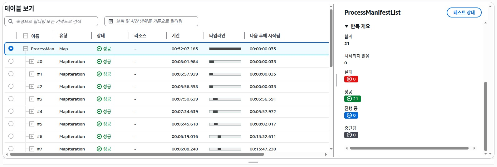
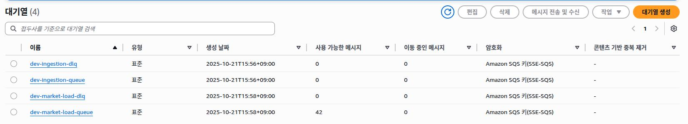
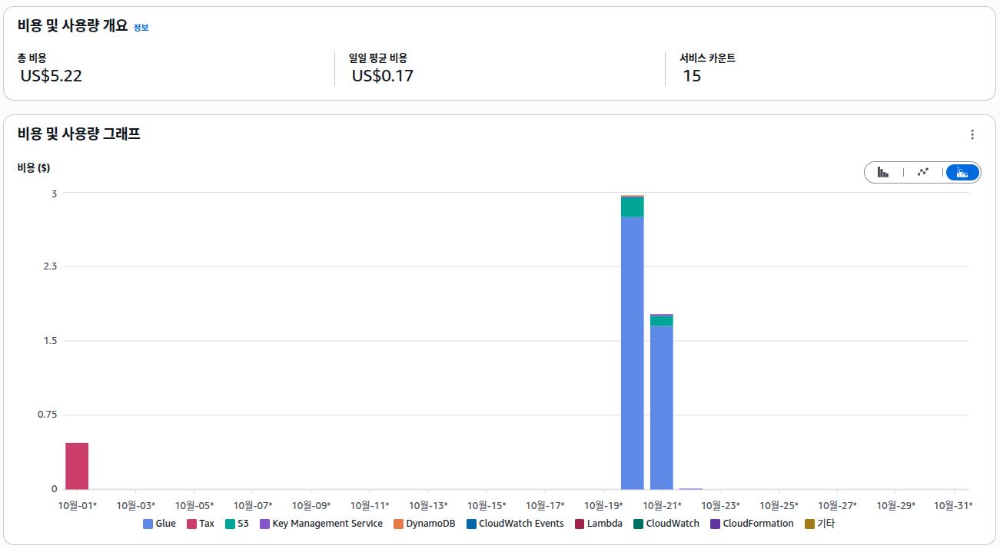

# Screenshots Overview

\[이미지 클릭\] → \[오른쪽 상단 Raw\]

#### \[Step Functions Execution Table\]

- Transform Map 실행별 상태/소요 시간 확인

 

#### \[SQS State Snapshot\]

- Load 단계 SQS 대기열 상태 모니터링 예시

 

#### \[Cost Explorer Snapshot\]

- dev 환경 30일치 데이터 처리 비용: 20일 2번, 21일 1번 테스트  
- 한달 약 $2 미만 비용 발생

 
