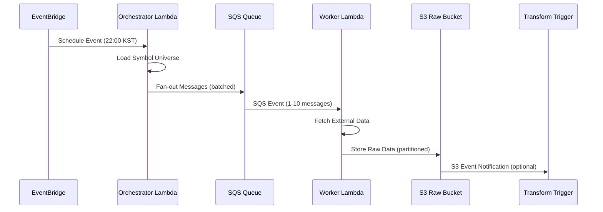

# Extract Pipeline Overview — 데이터 수집 파이프라인 명세

본 문서는 Extract 단계의 전체 아키텍처, 컴포넌트 간 상호작용, 그리고 데이터 플로우를 정의합니다. Extract는 외부 데이터 소스에서 Raw 데이터를 수집하여 Data Lake의 Raw 계층에 저장하는 첫 번째 단계입니다.

## 아키텍처 개요

Extract 파이프라인은 **Event-Driven Fan-Out 패턴**을 사용하여 확장 가능한 데이터 수집을 구현합니다.

### 핵심 컴포넌트

| 컴포넌트 | 역할 | 트리거 | 출력 |
|----------|------|--------|------|
| **EventBridge Schedule** | 정시 실행 트리거 | Cron 표현식 | Orchestrator Lambda 호출 |
| **Orchestrator Lambda** | 수집 대상 팬아웃 | EventBridge 이벤트 | SQS 메시지 배치 |
| **SQS Queue** | 비동기 작업 큐 | Orchestrator 메시지 | Worker Lambda 트리거 |
| **Worker Lambda** | 실제 데이터 수집 | SQS 이벤트 | S3 Raw 데이터 저장 |

### 데이터 플로우

## 지원하는 수집 패턴

### 1. **Scheduled Ingestion** (기본)
- **트리거**: EventBridge Rule (Cron)
- **용도**: 정기적인 시장 데이터, 배치 데이터 수집
- **예시**: 매일 22:00 KST에 전일 주가 데이터 수집

### 2. **Event-Driven Ingestion** (확장)
- **트리거**: 외부 시스템 EventBridge 이벤트
- **용도**: 실시간 또는 즉시 처리가 필요한 데이터
- **예시**: 신규 심볼 추가 시 즉시 수집

### 3. **Manual Ingestion** (운영)
- **트리거**: 직접 Lambda 호출
- **용도**: 재처리, 백필, 테스트 목적
- **예시**: 특정 날짜 범위 데이터 재수집

## 확장성 및 성능

### Fan-Out 전략
- **Chunk Size**: 심볼을 작은 그룹으로 분할 (기본 5개)
- **SQS Batch**: 최대 10개 메시지를 배치로 전송
- **병렬 처리**: Worker Lambda 동시 실행으로 처리량 확대

### 처리 용량
| 설정 | 값 | 설명 |
|------|-----|------|
| Orchestrator Memory | 256MB | 경량 팬아웃 작업 |
| Worker Memory | 512MB+ | 외부 API 호출 및 데이터 처리 |
| SQS Visibility Timeout | Worker Timeout × 6 | 재처리 방지 |
| Dead Letter Queue | 5회 재시도 후 | 실패 메시지 격리 |

## 도메인 지원

Extract 파이프라인은 Multi-Domain을 지원하며, 각 도메인별로 독립적인 스택을 배포합니다.

### 현재 지원 도메인
- **customer-data**: 고객 관련 마켓 데이터 (Yahoo Finance)
- *(확장 가능)*: product-data, financial-data 등

### 도메인별 설정
각 도메인은 독립적인 구성을 가집니다:
- 전용 SQS 큐 및 DLQ
- 도메인별 IAM 역할 및 권한
- 독립적인 스케줄 및 알람

## 모니터링 및 관찰성

### CloudWatch 지표
- **SQS Queue Depth**: 대기 중인 메시지 수
- **Oldest Message Age**: 가장 오래된 메시지 연령
- **Lambda Errors/Throttles**: Worker 실행 실패 및 제한

### 알람 설정
| 지표 | 임계값 | 평가 기간 | 조치 |
|------|--------|-----------|------|
| Queue Depth | 100개 | 5분 | 처리 용량 확인 |
| Message Age | 300초 | 5분 | Worker 상태 점검 |
| Lambda Errors | 1개 | 5분 | 즉시 조사 필요 |

### 대시보드
- SQS 큐 상태 (깊이, 연령)
- Lambda 성능 (에러, 처리량, 지연시간)
- S3 저장 통계 (파일 수, 바이트 수)

## 운영 고려사항

### 재시도 정책
- **Orchestrator**: 1회 재시도 (SQS 발행 실패 시)
- **Worker**: SQS 기반 자동 재시도 (최대 5회)
- **External API**: Worker 내부에서 1-2회 재시도

### 비용 최적화
- **예약 동시성**: Worker Lambda에 적용하여 콜드 스타트 최소화
- **SQS 배치**: 메시지 그룹화로 Lambda 호출 횟수 감소
- **압축**: GZIP 압축 옵션으로 S3 저장 비용 절약

### 보안
- **IAM 최소 권한**: 각 컴포넌트별 필요 최소 권한만 부여
- **SQS 암호화**: 전송 중 및 저장 시 암호화
- **VPC 엔드포인트**: AWS 서비스 간 프라이빗 통신 (옵션)

## 다음 단계 연계

Extract 완료 후 Transform 단계로의 자동 연계:
1. **S3 Event Notification**: Raw 데이터 저장 시 이벤트 발생
2. **EventBridge Integration**: Transform Step Functions 트리거
3. **Metadata 전달**: 파티션 정보 및 데이터 위치 전달

---

*본 명세는 `infrastructure/pipelines/customer_data/ingestion_stack.py` 구현을 기반으로 작성되었습니다.*